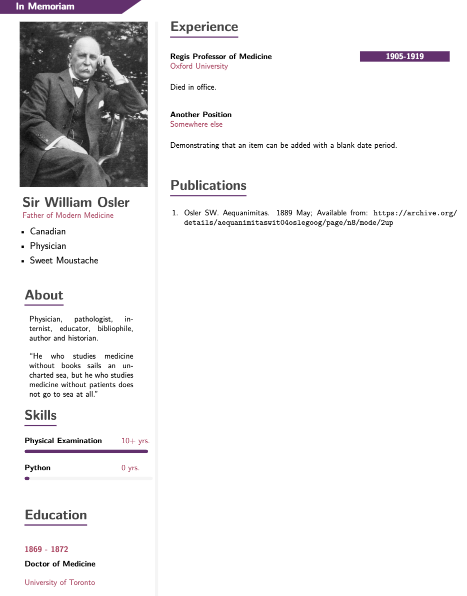

# quarto-cv Format

A template to create an academic CV with Quarto, that allows use of a bibtex bibliography for import of published works. This was adapted from [modern2-cv](https://github.com/schochastics/modern2-cv), which was in turn adopted from this [modern Latex CV](https://github.com/philipempl/modern-latex-cv).



## Installing

```bash
quarto use template cjdbarlow/quarto-cv
```

This will install the extension and create an example .qmd file that you can use as a template for development.

## Format Options

See the template for all possible format options.